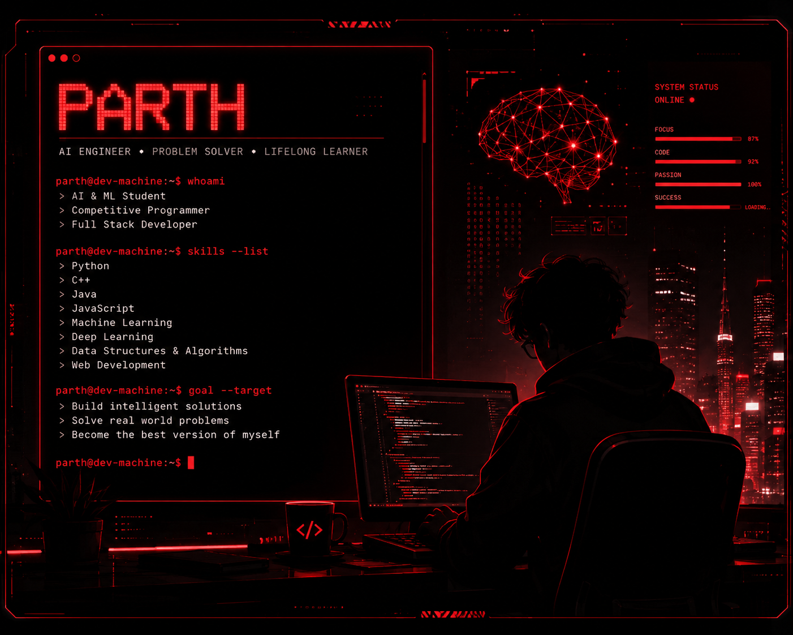

<div align="center">


<a href="https://github.com/parthmishra9942">
  
</a>

<br><br>

<a href="https://linkedin.com/in/parth-mishra-4b7578242"></a>
<a href="mailto:parthmishra9942@gmail.com"></a>
<a href="https://leetcode.com/u/parth213g/"></a>
<a href="https://www.geeksforgeeks.org/profile/parthmisbx98"></a>
<a href="https://ai-portfolio-beige-xi.vercel.app/"></a>

<br><br>


</div>

---

## ❤️ About Me

<table>
<tr>
<td width="60%" valign="top">

```bash
$ whoami
Parth Mishra

$ education
B.Tech CSE (AI & ML) · VIT Bhopal University · Batch 2027

$ interests
Artificial Intelligence · Machine Learning
Competitive Programming · Web Development · Open Source

$ currently_learning
DSA · React · Backend Development · AI Engineering

$ looking_for
SDE · Full-Stack · AI/ML Engineering roles (2027 placements)

$ open_to
Bangalore · Pune · Delhi NCR · Hyderabad · Mumbai · Remote

$ goal
Become the best version of myself.
```

</td>
<td width="40%" align="center" valign="middle">



</td>
</tr>
</table>

---

## ⚙️ Tech Stack

<p align="center">

</p>

---

## 🚀 Featured Projects

| Project | What it does | Stack |
|---|---|---|
| 📱 **Insta Insights** | Full-stack mobile Instagram analytics platform with license-key access, a browser-based admin dashboard, and Instagram-style profile and insights screens. | React Native, Expo, Node.js, Express, TypeScript, PostgreSQL (Supabase) |
| 🥗 **AIMealTracker** | Macro tracker for Indian vegetarian meals, built around lean muscle gain. Claude API turns plain-language meals into macros. | React, Vite, Claude API |
| 🔎 **DPI Packet Analyzer** | Network packet analyzer built around deep packet inspection. | *add stack* |
| 🧬 **VectorDB** | Vector database codebase I ported and studied in depth: HNSW, KD-Tree, brute-force k-NN, RAG pipeline with Ollama, Flask REST API. | Python, Flask, Ollama |

<sub>Tip: link each project name to its repo, e.g. `[**Insta Insights**](https://github.com/parthmishra9942/<repo>)`.</sub>

---

## 📊 GitHub Stats

<p align="center">


</p>

<p align="center">

</p>

## 💻 LeetCode

<p align="center">

</p>

## 📈 Contribution Graph

<p align="center">

</p>

## 🐍 Contribution Snake

<p align="center">

</p>

## 💬 Dev Quote

<p align="center">

</p>

<div align="center">

### ❤️ Thanks for visiting!


</div>
